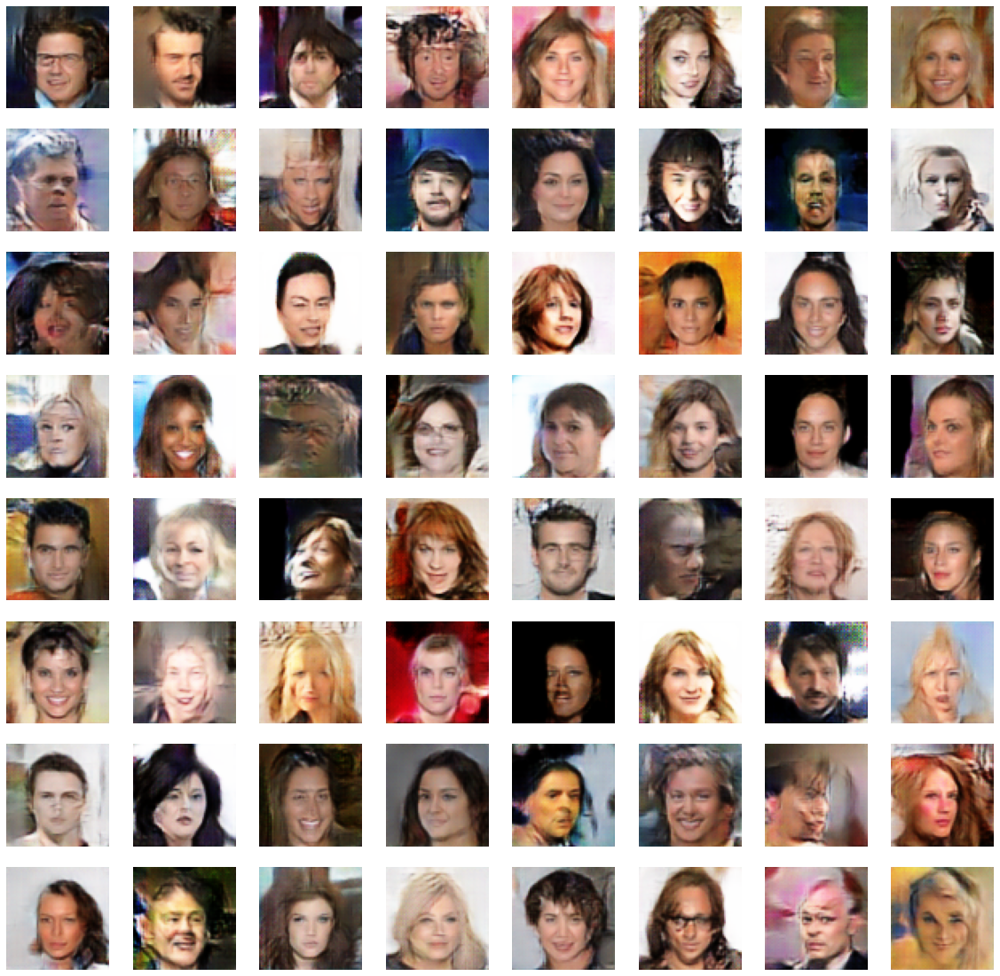
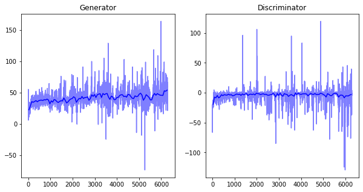
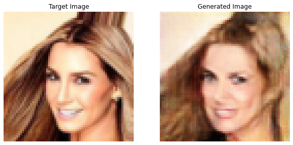
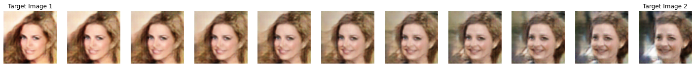

WGAN-GP (Wasserstein GAN - Gradient Penalty) with CelebA dataset
=============

## Model
### Generator:  
> 1x1x(nz) → 4x4x1024 → 8x8x512 → 16x16x256 → 32x32x128 → 64x64x3
  
### Discriminator:  
> 64x64x3 → 32x32x64 → 16x16x128 → 8x8x256 → 4x4x512 → 1x1x1

### Gan Loss:  
> CrossEntrophy (= Vanilla GAN)
  
------------------
## Output Images  
  

------------------
## Loss  
  

------------------
## How generator improved
  

------------------
## Find latent vectors for real images  
  
  
## Linearly mapping images  
    
   
